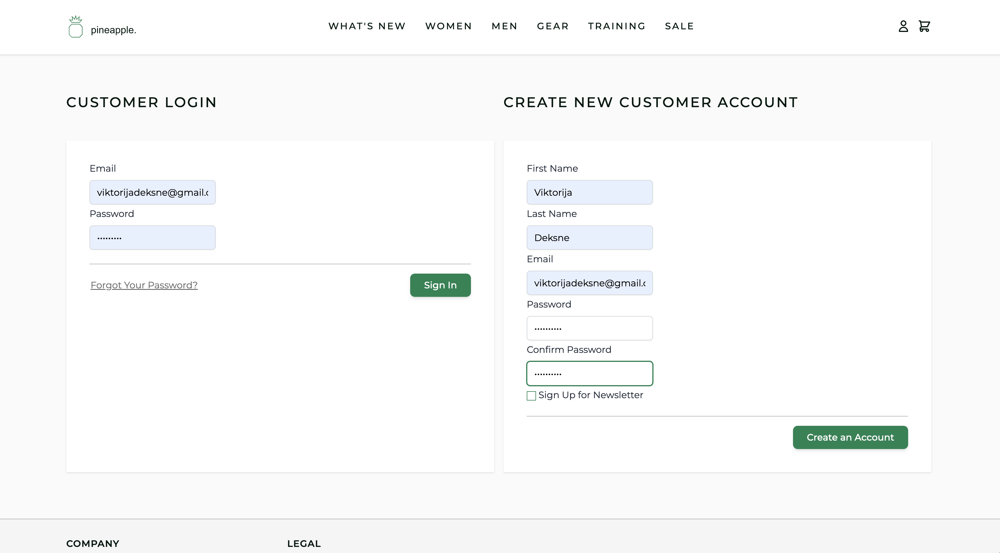

# Laravel: Blog Application

## Project Overview

This Laravel-based blog application is fully functional, responsive, and offers register, login and logout features. The application is designed to be user-friendly and visually appealing, with a focus on providing a seamless experience for both users and administrators.

{width=400px}

## Project Specifications

**Read-Only Files**

- tests/\*

**Environment**

- PHP version: 7.4
- Laravel version:
- Default Port: 8000
- Sqlite3 (PHP package)

**Commands**

- run:

```bash
yes | php artisan migrate && npm run watch
```

- install:

```bash
composer install && npm install
```

- test:

```bash
yes | php artisan migrate:refresh && ./vendor/bin/phpunit tests --log-junit junit.xml
```
